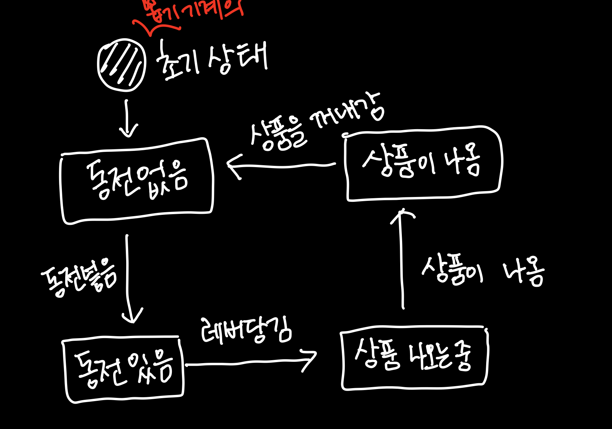

# state pattern

#### state pattern?

- 객채의 내부 상태가 바뀜에 따라 객체의 행동을 바꿀 수 있음
- 마치 객체의 클래스가 바뀌는 것과 같은 결과 얻음
- 이는 객체 자체를 더 dynamic 하게 만들고 코드 내부의 조건문을 줄일 수 있음

- 값 속성 저장한 다음 객체 메서드 내에서 조건문을 사용해 다른 출력을 생성하는 대신,
  하위 클래스가 handle로 할당됨
- 개체/컨텍스트는 작업이 위임된 할당된 하위클래스 내부작업을 알 필요가 없음
- 개체 상태 동작이 이를 처리하기 위해 동적으로 할당된 하위클래스 내에 캡슐화되기 때문

#### state pattern UML Diagram

- state: state 는 콘텍스트의 특정 상태에 대한 행동이 캡슐화된 인터페이스
- concreteSate: context로부터 전달된 요청 처리
- context: 상태가 정의된 객체, 그러나 상태 행동의 실행은 concrete 하위 객체가 함

#### 예시에 대한 각 상태와 행동
본 예시는 뽑기 기계에 동전을 넣고 상품이 나오기 까지의 과정에서 뽑기 기계의 상태를 기준으로 설명

##### 상태
- 동전 없음
- 동전 있음
- 상품 나오는 중
- 상품이 나옴

##### 행동
- 동전 넣음
- 레버 당김
- 상품이 나옴
- 상품을 꺼내감

